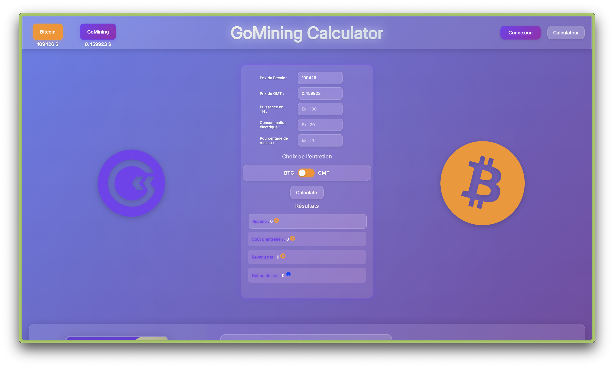
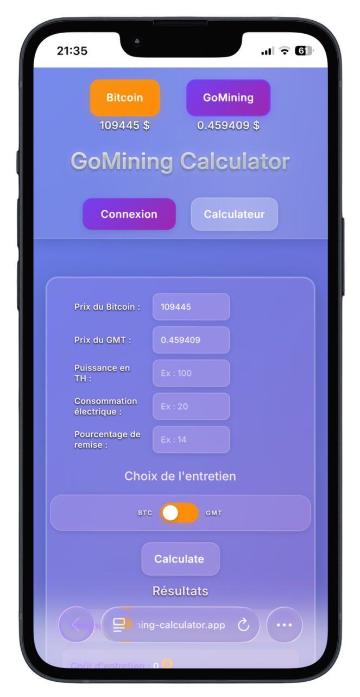

# GoMining Calculator

A comprehensive web-based calculator for GoMining rewards and investment planning, built with HTML, CSS, and JavaScript.

## Overview

This project provides a simple yet powerful tool to calculate mining rewards and return on investment (ROI) for GoMining users. It features two main calculation modes:

- **Rewards Calculator** (index.html) - Calculate daily, monthly, or yearly mining rewards
- **Investment Plan** (investment_plan.html) - Simulate long-term investment strategies

🌐 **Live**: [https://gomining-calculator.app/](https://gomining-calculator.app/)

## Features

### Core Functionality

- **Real-time price integration** via CoinGecko API for BTC and GMT prices
- **Dual maintenance mode** - Choose between BTC or GMT for fee payments
- **Comprehensive calculations** including:
  - Gross mining rewards
  - Electricity consumption costs
  - Service fees
  - Net profit in BTC and USD
  - Investment cost analysis
- **Investment planning** with monthly TH purchases over customizable periods
- **Responsive design** optimized for desktop, tablet, and mobile devices

### Additional Features

- **Bitcoin halving countdown** timer
- **Quick copy functionality** for donation addresses
- **Automatic recalculation** on input changes
- **Professional UI/UX** with modern design elements

## Screenshot

|  |  |
|-------------------------|-------------------------|

## Project Structure

```
GoMining-Calculator/
│
├── images/                  # Assets and icons
│   ├── btc_icon.png
│   ├── gmt-con.png
│   ├── presentation.png
│   └── ...
├── index.html              # Main rewards calculator page
├── investment_plan.html    # Investment planning simulation
├── legal_notice.html       # Legal information and privacy policy
├── style.css               # Main stylesheet
├── responsive.css          # Responsive design rules
├── main.js                 # Common JavaScript (prices, navigation, interactions)
├── calculator.js           # Rewards calculation logic
├── investment_plan.js      # Investment planning logic
└── README.md               # This file
```

## Getting Started

### Prerequisites

- A modern web browser (Chrome, Firefox, Safari, Edge)
- Internet connection (for real-time price data)


### Installation

1. Clone or download this repository
2. Open `index.html` in your web browser
3. No additional setup required - the application runs entirely in the browser

### Usage

#### Rewards Calculator

1. Navigate to the main page (`index.html`)
2. Enter your mining parameters:
   - Bitcoin price (auto-filled from API)
   - GMT price (auto-filled from API)
   - TH power (mining hash rate)
   - Electrical efficiency (W/TH)
   - Discount percentage
3. Choose maintenance mode (BTC or GMT)
4. Select calculation period (daily/monthly/yearly)
5. View real-time results

#### Investment Planning

1. Navigate to the investment plan page (`investment_plan.html`)
2. Enter initial parameters plus:
   - Monthly TH investment amount
   - Investment duration (months)
3. Review projected earnings and costs over the investment period

## API Integration

The application integrates with the [CoinGecko API](https://www.coingecko.com/) to provide real-time cryptocurrency prices:

- Bitcoin (BTC) price
- GMT Token price
- Automatic price updates

## Dependencies

### External Libraries

- [Font Awesome](https://fontawesome.com/) - Icon library
- [Google Fonts (Inter)](https://fonts.google.com/specimen/Inter) - Typography

### APIs

- [CoinGecko API](https://www.coingecko.com/api) - Cryptocurrency price data

## Browser Support

- Chrome 60+
- Firefox 55+
- Safari 12+
- Edge 79+

## Development

### Local Development

1. Clone the repository
2. Open files in your preferred code editor
3. Use a local server (optional but recommended):

   ```bash
   # Using Python
   python -m http.server 8000

   # Using Node.js
   npx serve .
   ```

### Code Structure

- **HTML**: Semantic markup with accessibility considerations
- **CSS**: Modular styles with responsive design patterns
- **JavaScript**: Vanilla JS with modern ES6+ features

## Contributing

We welcome contributions! Please follow these guidelines:

### How to Contribute

1. Fork the repository
2. Create a feature branch (`git checkout -b feature/amazing-feature`)
3. Commit your changes (`git commit -m 'Add amazing feature'`)
4. Push to the branch (`git push origin feature/amazing-feature`)
5. Open a Pull Request

### Development Guidelines

- Follow existing code style and formatting
- Test changes across different browsers
- Update documentation for new features
- Ensure responsive design compatibility

## Legal Information

Please review [legal_notice.html](legal_notice.html) for:

- Privacy policy
- Terms of use
- Intellectual property information
- Contact details

## Disclaimer

⚠️ **Important**: This calculator is provided for informational purposes only. The calculations are estimates based on current market conditions and user-provided data. This tool does not constitute financial advice, and users should conduct their own research before making investment decisions. Cryptocurrency mining involves risks, and past performance does not guarantee future results.

## License

This project is open source and available under the [MIT License](LICENSE).

## Support

For questions, issues, or feature requests:

- Create an issue on GitHub
- Check existing issues for solutions
- Review the legal notice for contact information

---

**Built with ❤️ for the GoMining community**
